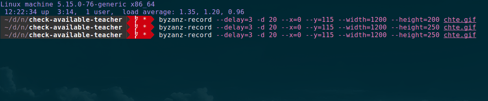

## Check if teacher is available on a particular date.

Sometimes when I try to book an English class the date could be already fully booked, but there is a chance when someone cancel a class. To catch that moment and book an available time is what this app for. The app has a cron job which call an api per particular amount of requests per particular amount of time to avoid ddos. Telegram bot sends a message if env vars available and a flag `--notify` is provided.

To run the app just run `./run.sh --help`
To run the app with main command `./run.sh check-teacher`

If sending message to telegram needed need to provide `TELEGRAM_CHAT_ID` and `TELEGRAM_BOT_TOKEN` in `.env` file.

P.S. and I know this can be done in a single file with a couple of lines of code
